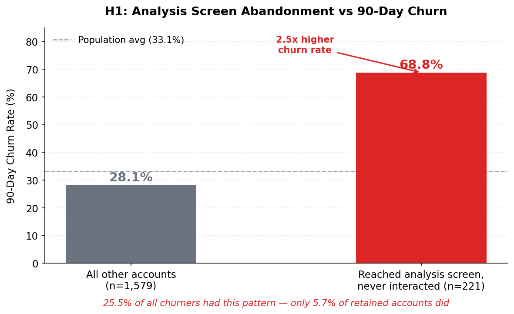
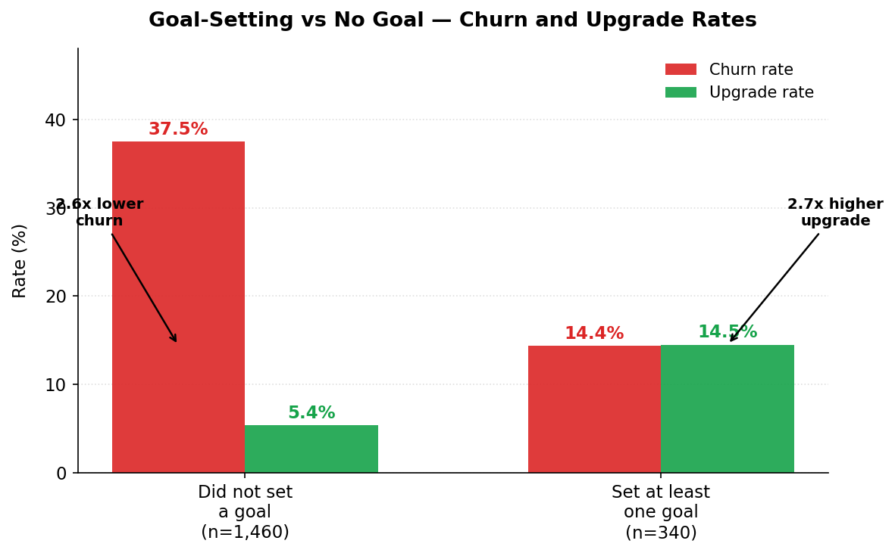
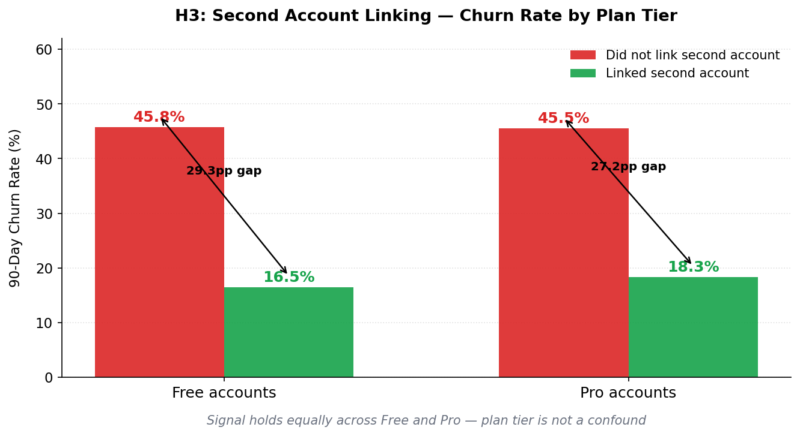
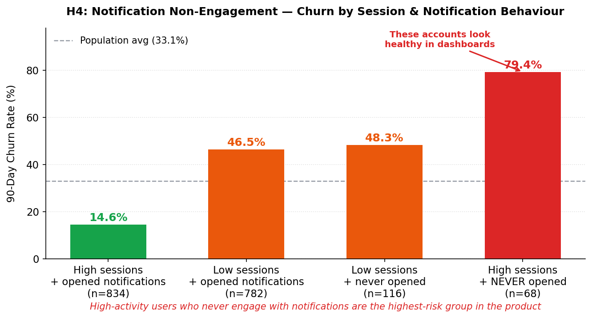

# EIM Hypothesis Report — FinWise
**Dataset:** finwise_accounts.csv, finwise_feature_events.csv, finwise_monthly_snapshots.csv, finwise_onboarding.csv, finwise_users.csv
**Analysis date:** 2026-05-19
**Outcome variables:** `churned_90d` (all accounts), `upgraded_90d` (free accounts only)
**Context base:** finwise-context-base.md

---

## Population baseline

| Metric | Value |
|---|---|
| Total accounts in dataset | 1,800 |
| Plan split | 675 Pro (37.5%), 1,125 Free (62.5%) |
| Overall 90-day churn rate | 33.1% (596 accounts) |
| Free-to-Pro upgrade rate | 7.0% (79 of 1,125 free accounts) |
| Estimated full user base | 380,000 registered users |
| ARR leverage | ≈$380K per 1pp improvement in Pro conversion |

---

## Hypothesis 1: Analysis View — The Value Visibility Gap

**Evidence**

221 accounts (12.3% of the dataset) reached the analysis_view screen but only ever abandoned it — they opened the charts screen, spent roughly 20 seconds or less, and left without interacting. Not one of these accounts has a single `analysis_view: used` event. These accounts churn at **68.8%** within 90 days (152 of 221), compared to **28.1%** for all other accounts (n=1,579) — a **2.5x difference**. Among all 596 churned accounts, 25.5% had this pattern; among 1,204 retained accounts, only 5.7% did. Controlling for goal-setting (the strongest single retention predictor), the signal holds independently: among accounts with no savings goal, analysis-only-abandoned accounts churn at 69.6% (n=207) vs 32.2% (n=1,253) for those who at least used the analysis screen once (2.2x).

This is not a usage-frequency problem — these accounts did visit the analysis screen. It is a value visibility problem: the product is not making the insight legible enough in the first interaction for users to understand why they should return.

**Impact**

At the full 380,000-user base, accounts with this pattern represent approximately 46,700 users. Of those, an estimated 17,500 are Pro accounts (at the dataset's 37.5% Pro rate). If the analysis-only-abandoned cohort's churn rate were reduced from 68.8% to the population baseline of 33.1% — a 35.7 percentage-point reduction — approximately 6,250 Pro accounts would be retained annually. At $119.88 ARR per Pro account: **≈$749K ARR at full scale**. Even a 25% reduction in excess churn = ≈$188K ARR. This is also a conversion problem: none of the 79 upgrade events in the dataset came from analysis-only-abandoned accounts — suggesting this group never reaches the product depth required to hit the upgrade trigger.

**Mechanism**

Trigger a first-use guided moment specifically for accounts where `analysis_view` has been opened but never interacted with. On the account's next `analysis_view` open (second visit or after any abandonment), surface a contextual overlay — not a generic tour, but a data-personalised highlight: pull 2–3 actual insights from the account's own transactions (e.g., "Your dining spend is 40% above last month" or "You've spent $340 on subscriptions this month") and make them tappable. Each tap should drill into the relevant category. End with a single prompt that bridges to goal-setting: "Want to set a limit on dining?" — which routes directly to goal creation. Gate the overlay to accounts with zero `analysis_view: used` events. Target the trigger within the first 7 days of account creation, before the disengagement pattern solidifies. Test as a 50/50 holdout measuring 30-day analysis_view engagement rate and 90-day churn.

---

## Hypothesis 2: Goal Activation — The Missing Personalisation Moment

**Evidence**

Savings goal creation is the single strongest predictor of retention and conversion in the dataset. 1,460 of 1,800 accounts (81.1%) never set a first savings goal. These accounts churn at **37.5%** within 90 days. Accounts that set at least one goal churn at **14.4%** — a **2.6x difference** (n=1,460 vs n=340). The upgrade signal is equally sharp: free accounts that set a first goal upgrade at **14.5%** vs **5.4%** for those that don't (2.7x). The conversion pipeline is almost entirely dependent on goal-setting: **98.7% of all 79 upgrade events** (78 of 79) came from accounts that had previously hit the savings_goal paywall (`savings_goal: blocked` event), confirming the product context document's claim that the goal-limit hit is the primary upgrade trigger. But only 18.9% of accounts reach that trigger — 81.1% never get close enough to goal-setting to even experience the paywall.

The onboarding data confirms where this breaks down: `set_first_goal` has a **18.9% completion rate** — the lowest of any onboarding step — with the sharpest drop occurring between `view_first_spending_summary` (51.6% completion) and `set_first_goal` (18.9%). The product shows users their data and then asks them to do something with it, but 63% of accounts who saw their first spending summary did not go on to set a goal.

**Impact**

1,460 free and Pro accounts never set a goal. At the 380,000-user scale, that is approximately 308,000 accounts. The upgrade gap between goal-setters (14.5%) and non-goal-setters (5.4%) represents a **9.1 percentage-point conversion opportunity** on the free population. The product context notes that every 1 percentage point improvement in Pro conversion = ≈$380K ARR. If goal activation could move even 20% of the 62.5% free non-goal-setter population (roughly 37,700 additional accounts) to set a goal — raising their upgrade rate toward 14.5% — the resulting 3,400+ additional upgrades would represent **≈$1.3M incremental ARR** at the $380K per percentage point metric. Even a conservative 2pp improvement in overall conversion = **$760K ARR**. Churn reduction compounds this: 308K accounts at 37.5% vs 14.4% churn means approximately 70,700 accounts churning in excess of the goal-setter baseline annually.

**Mechanism**

The current onboarding flow shows spending data and then leaves goal-setting as a voluntary next step. The intervention is to collapse this gap. Immediately after `view_first_spending_summary` (the moment where the user has just seen their own data for the first time), prompt goal creation inline — not as a separate screen, but as a continuation of the insight moment: "You spent $X on [top category] last month. Do you want to set a target?" with a pre-populated goal amount based on their actual spend. Remove the friction of an empty-state goal screen by anchoring the goal to data the user just saw.

For accounts that completed spending_summary but did not set a goal in the same session, trigger a single in-app banner on next open (day 2 or 3): "You haven't set a goal yet — most users who do spend 30% less in their top category within 60 days." Keep it one tap to goal creation. Do not use push notifications for this — the goal is to reach users who are already in-app, not to re-engage disengaged users. Test with a 50/50 holdout on new accounts, measuring `set_first_goal` completion rate and 90-day upgrade rate as primary outcomes. Guardrail: do not increase time-to-first-spending-summary (the prior step must not be disrupted).

---

## Hypothesis 3: Second Account Linking — The Commitment Signal

**Evidence**

Linking a second financial account is a stronger churn predictor than plan tier. Of 1,800 accounts, 1,004 (55.8%) never linked a second account. These accounts churn at **45.7%** within 90 days. Accounts that linked two or more accounts churn at **17.2%** — a **2.7x difference** (n=1,004 vs n=796). Critically, this signal holds equally across plan tiers: free non-linkers churn at 45.8% vs 16.5% for free linkers; Pro non-linkers churn at 45.5% vs 18.3% for Pro linkers. Plan tier is not a confound — the linking behaviour itself predicts retention independently. The `link_second_account` onboarding step has a 44.2% completion rate, making it the second-lowest completed onboarding step and the clearest early-session behaviour that separates retained from churned accounts.

The interpretation is straightforward: an account with one linked bank account sees a partial picture of its finances. Adding a credit card or a second bank account makes the product more complete — it becomes harder to leave because leaving means losing visibility into all your accounts, not just one.

**Impact**

1,004 accounts never linked a second account. At 380,000 users, that is approximately 212,000 accounts. Of those, ≈79,500 are Pro accounts (37.5%). Pro non-linkers churn at 45.5% vs 18.3% for Pro linkers — a 27.2 percentage-point excess. That means approximately 21,600 Pro accounts are churning in excess of what they would if they had linked a second account. At $119.88 ARR: **≈$2.59M ARR at excess risk from this group alone**. A 20% reduction in excess Pro churn = **≈$518K ARR retained**. For free accounts, the linking effect also substantially improves upgrade conversion: the product becomes stickier and more worth paying for when it reflects more of a user's financial life.

**Mechanism**

The current onboarding prompts second account linking as a standalone step with no explicit value framing. The intervention is to make the value of a second account visible before asking for it. Immediately after the first account is linked and the user sees their first transaction list, surface a prompt: "This is [Bank Name]. Add your credit card to see the full picture — most users who do find $200+ in hidden monthly spend." Frame it as a completeness problem, not a feature upsell.

For accounts that do not link a second account within the first session: send a single push notification on day 2 that references their actual data — "[X] transactions synced from [Bank Name]. Missing your credit card? Add it in 30 seconds." The notification should deep-link directly to the account-linking screen, not the home screen. Do not send this notification to accounts that have already linked a second account. Measure: `link_second_account` completion rate within 7 days (primary), 90-day churn (secondary). Guardrail: no increase in account_link abandonment rate.

---

## Hypothesis 4: Notification Non-Engagement — The Silent Churn Signal

**Evidence**

184 accounts (10.2% of the dataset) received at least one push notification but never opened a single one. These accounts churn at **59.8%** — nearly double the population rate of 33.1% (n=184 vs n=1,616 who opened at least one, 2.0x difference). 110 of 184 churned.

The most striking finding is the interaction with session frequency. When controlling for whether accounts had above-median sessions: accounts with **high session frequency AND no notification engagement** churn at **79.4%** (n=68). These are accounts the product team would likely classify as healthy based on session counts — they open the app regularly — but they are at the highest churn risk in the dataset. The working hypothesis is that these accounts are using the app passively (checking transactions, not taking actions) and have no re-engagement mechanism when they eventually go quiet.

The monthly snapshot data confirms the directionality: churned accounts had a 9.7% average notification open rate in their earliest months, vs 29.1% for retained accounts. This is not a decay pattern — it is a never-engaged pattern. Churned accounts never built the habit of responding to notifications from the first session.

**Impact**

At 380,000 users, 10.2% of accounts = approximately 38,800 notification-ignoring accounts. Of those, ≈14,550 are Pro accounts. Their excess churn over baseline (59.8% vs 33.1% = 26.7pp) puts approximately 3,885 Pro accounts at excess risk annually. At $119.88 ARR: **≈$466K ARR at excess risk**. The high-sessions subgroup (79.4% churn, n=68 in dataset) scales to approximately 9,000 accounts at the full user base — these represent the accounts most likely to surprise the retention team, since session counts would suggest they are healthy.

**Mechanism**

The root problem is that push notifications are not personalised enough in the first 14 days to earn engagement. Generic spend alerts or feature announcements will not convert a notification-ignorer. The intervention has two phases.

Phase 1 (days 1–7): Replace the default notification content for new accounts with a spending summary format personalised to their actual data: "You've spent $X so far this month. [Top category] is your biggest expense." This is a fact about *their money*, not a marketing message. Accounts that open this notification within the first 7 days are removed from the at-risk list. Measure notification open rate for days 1–7 cohort.

Phase 2 (day 8, accounts that never opened any notification): Do not send another push. Instead, on the next in-app session, surface an in-app banner — not a modal — with a single spending insight and a one-tap action: "You haven't set up spend alerts yet. Want to know when you're close to your dining limit?" This converts a notification-ignorer into an in-app value moment before they fully disengage. Test as a 50/50 holdout measuring 30-day notification open rate and 90-day churn. Guardrail: no increase in notification unsubscribe rate.

---

## What We Ruled Out

**Session frequency quartile** — Q1 (lowest sessions) churns at 57.6% vs Q4 (highest) at 5.1%. A strong signal, but not actionable as a mechanism: session frequency is a downstream indicator of whether the product delivered value, not a point of intervention. The hypotheses above (H1–H4) target the upstream behaviours that produce high session frequency in retained accounts.

**Notification open rate decay** — A declining notification open rate over time appeared as a candidate signal. On investigation, it is not a decay pattern in churned accounts — churned accounts had a 9.7% open rate from their earliest months (never engaged), while retained accounts maintained a 29.1% early rate. H4 captures this more accurately as a never-engaged signal rather than a decay signal.

**Uncategorised transaction rate** — Accounts with >20% of transactions uncategorised churn at 42.3% vs 19.2% (2.2x). On controlling for session frequency, this effect largely disappears: the uncategorised rate is a symptom of low engagement, not an independent cause. Completing the `customise_first_category` onboarding step does predict better churn outcomes (21.1% vs 34.7%) but the n=213 vs n=1,587 split and the confounding with other activation behaviours makes this insufficient as a standalone hypothesis. Not dismissed — worth monitoring as a secondary metric in H2 (goal activation) and H3 (account linking) interventions.

**Mint refugee cohort** — Mint refugees upgrade at 11.0% (free tier) vs 6.7% for non-mint free accounts (1.6x). Overall churn is 32.6% vs 33.1% population average — within noise. While the product context document suggests months 4–6 churn is elevated for this cohort, the 90-day outcome window in this dataset does not capture that effect, and the n=82 free Mint refugees is insufficient for confident multi-variable analysis. Recommend a dedicated cohort analysis with a 6-month outcome window.

**Paid social acquisition churn** — 36.7% vs 31–33% for other channels (1.1x). Below the 1.5x threshold for hypothesis-worthy signals.

---

## Recommended Next Steps

**Rank by confidence × impact:**

| Priority | Hypothesis | Confidence | Impact (full scale) | Why first |
|---|---|---|---|---|
| 1 | H2: Goal Activation | High | $760K–$1.3M ARR | Largest population (308K accounts), strongest dual signal on both churn and upgrade, directly addresses the business conversion target (4.2% → 8.0%) |
| 2 | H1: Analysis View | High | ≈$188–$749K ARR | Cleanest mechanism (specific trigger condition), signal holds when controlling for other variables, zero-cost to identify the cohort (existing event data) |
| 3 | H3: Second Account Linking | High | ≈$518K ARR | Largest ARR at risk from a single cohort, signal holds across plan tiers, mechanism is a single in-session prompt |
| 4 | H4: Notification Non-Engagement | Medium | ≈$466K ARR | Strong signal, but mechanism requires content personalisation infrastructure. The high-sessions subgroup (79.4% churn) is the most urgent sub-case — these are accounts the team currently thinks are healthy |

**Run H2 and H1 together.** The goal activation mechanism (H2) ends with a prompt to create a goal, which routes to `analysis_view` after goal creation — meaning H1's first-use guide would fire immediately after. These two interventions compose naturally into a single onboarding improvement that addresses the `view_first_spending_summary` → `set_first_goal` drop-off in one product moment.

**H3 is the highest ARR hypothesis but requires the least product work.** The prompt to link a second account can be implemented as a single in-session banner with a deep-link — no new screen, no new flow. Run it quickly as a holdout test before H2 is fully built.

**H4 requires validating with the content team before building.** The personalised notification approach depends on having the spend data ready to populate within hours of the notification window. Confirm data pipeline latency before scoping the feature.

---

*No qualitative data was available for this analysis. Recommend validating the top two hypotheses (H2, H1) against customer call recordings or support ticket themes before committing to build scopes. The analysis identifies where the data points — the team's qualitative knowledge is the check on whether the mechanisms proposed match how users actually think about their money.*

*Analysis conducted on a 1,800-account dataset (snapshot date: 2026-03-01). No sampling applied — all tables were within size limits. Full dataset row counts: accounts 1,800 | feature_events 74,171 | monthly_snapshots 16,448 | onboarding 10,800 | users 1,800.*
